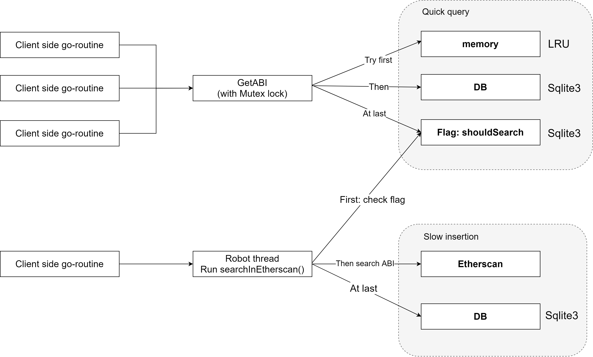
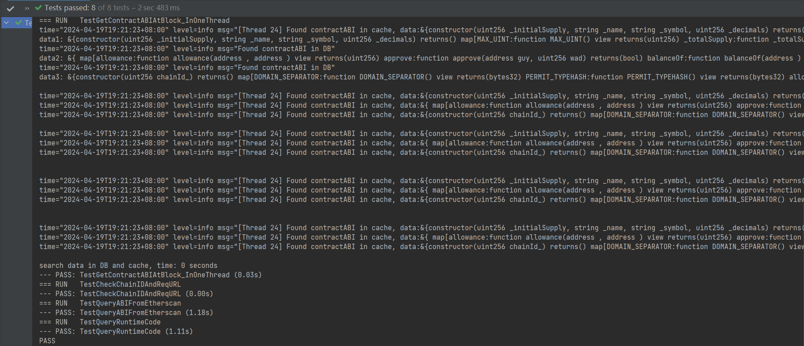
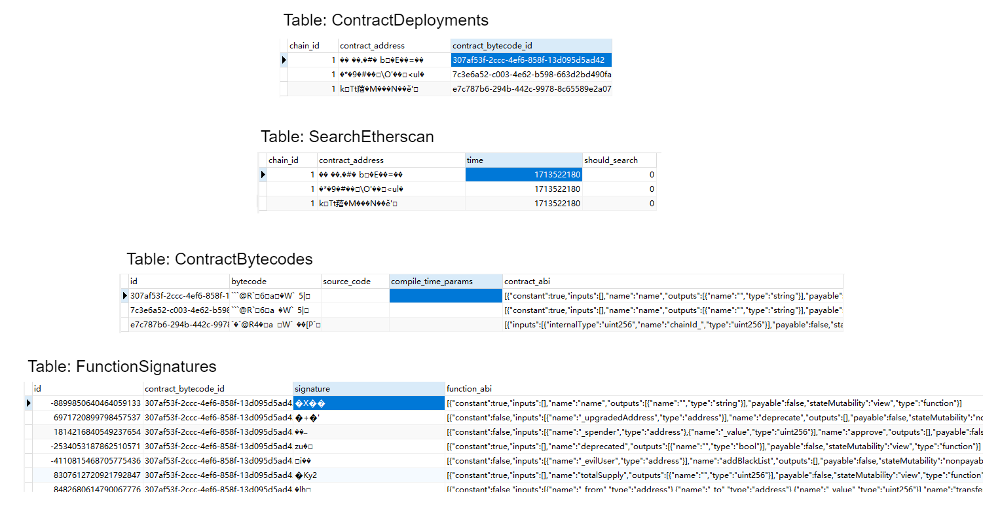

# EVM-ABI-Fetcher

## Brief

The goal of this project is to cache smart contract ABIs in a database and provide a function to retrieve the ABI given a chain ID, contract address, and block number. The function should perform lazy fetching and caching to optimize performance.

## Specifications

- [Golang](https://go.dev/)
- [gorm](https://gorm.io/index.html)
- [Sqlite3](https://www.sqlite.org/)
- [Etherscan API](https://docs.etherscan.io/getting-started/viewing-api-usage-statistics) and [blockchain node RPC](https://go.dev/)

## The design choices

### Main

architecture



Based on the architecture, we have designed four tables:

```go
type ContractBytecode struct {
	ID                uuid.UUID `gorm:"type:uuid;primary_key"` // contract bytecode unique identifier
	Bytecode          []byte    `gorm:"type:blob"`             // contract bytecode
	SourceCode        string    `gorm:"type:text"`             // contract solidity source code
	CompileTimeParams string    `gorm:"type:text"`             // constructor parameters
	ContractABI       string    `gorm:"type:text"`             // The whole ABI of the contract
}

type FunctionSignature struct {
	ID                 int64     `gorm:"type:bigint;primary_key"` // function signature unique identifier
	ContractBytecodeID uuid.UUID `gorm:"type:uuid;index"`         // contract bytecode unique identifier 
	Signature          []byte    `gorm:"type:blob;size:4"`        // function signature
	FunctionABI        string    `gorm:"type:text"`               // function ABI(json string)
}

type ContractDeployment struct {
	ChainID            int       `gorm:"type:int"`  // chainID
	ContractAddress    []byte    `gorm:"type:blob"` // contract address
	ContractBytecodeID uuid.UUID `gorm:"type:uuid"` // contract bytecode unique identifier
}

type SearchEtherscan struct {
	ChainID         int    `gorm:"type:int;index"` // Chain ID as integer
	ContractAddress []byte `gorm:"type:blob"`      // Contract address in byte array or hex
	Time            int    `gorm:"type:int"`       // Time as integer 
	ShouldSearch    bool   `gorm:"type:boolean"`   // Flag to indicate if a search should be performed
}
```

The core interface:

```go
func GetFunctionABIAtBlock(chainID int, contractAddress common.Address, sig [4]byte, block *big.Int) (*abi.Method, error)
func GetContractABIAtBlock(chainID int, contractAddress common.Address, block *big.Int) (*abi.ABI, error)
// func searchInEtherscan(apiKey string, rpcUrl string) error
```

### Details

- cache
  - Implement an in-memory cache using a map to store the most recently queried ABIs.
  - Use a cache size of 1000 entries.
  - Implement a least recently used(LRU) eviction policy to remove the least recently accessed entries when the cache reaches its maximum size.
  - Ensure thread-safety for concurrent access to the cache using a sync.RWMutex.

- Error handing and logging
  - If there is a timeout on Etherscan, wait and retry.
  - Handle errors gracefully and return appropriate error messages from the GetABI function.
  - Log errors and key events using the logrus logging package with the following log levels:
    - Error: For critical errors that prevent the function from executing properly.
    - Warning: For non-critical issues or unexpected behavior.
    - Info: For important events or milestones during the execution.
    - Log the input parameters, retrieved ABI, and any error messages for debugging purposes.

- Performance
  - Optimize database queries by creating appropriate indexes on the ChainID, ContractAddress, and FuncSignature columns using GORM: Re indexes, we are okay with slow inserts, but we want very fast query speed. Do you create indexes for your tables?
  - Implement caching to minimize the number of database queries and external API calls.
  - Aim for a maximum response time of 100ms for the GetABI function.

- Other stuff
  - The program will retrieve ABI from blockchain browsers corresponding to different chains and store it in the database. Now support Ethereum, BSC, Arbitrum, Polygon. 
  - For high-speed response, our designed query strategy: memory => database => Etherscan.
  - At the beginning of the program, due to the lack of data in the database and cache, the query speed will be slow (RPC calls consume a lot of time). When the program runs for a period of time and stores data in the database and cache, the speed of ABI queries will be very fast. 
  - Please note that if multiple threads simultaneously query ABI for the same contract, ABI may be repeatedly inserted into the cache. Our solution is to check twice: use a mutex lock and check again after obtaining the lock to prevent duplicate insertions in the cache.
  - For ease of use and debugging, we have returned errors in the program and printed out logs.

### Test

- cache
  - TestNewABICache()
  - TestSetAndGetCacheItem()
  - TestCacheEviction()
- database
  - TestContractBytecode()
  - TestSearchEtherscan()
  - TestFunctionSignature()
  - TestContractDeployment()
- fetch
  - TestUnmarshal()
  - TestFetchFunctionABIFromEtherscan()
  - TestFetchContractABIFromEtherscan()
  - TestGetFunctionABIAtBlock_InOneThread()
  - TestGetContractABIAtBlock_InOneThread()
  - TestCheckChainIDAndReqURL()
  - TestQueryABIFromEtherscan()
  - TestQueryRuntimeCode()

The test results of the core functions are roughly as follows:



And the data in database is like this:



## assumptions

- If the queried addresses are all open source contracts, the query speed will be very fast when the program runs stably.
- If the queried address is EOA or has not been verified, an error is returned.
- Deployed but unverified contracts will record a flag in the database and periodically crawl ABI from Etherscan. You can develop a strategy for `searchInEtherscan()`.
- The generated data will be stored in a file named `ABIs.db`.
- Implementing least recently used (LRU) using bidirectional linked lists and maps.
- To prevent duplicate insertion of data into the cache, we perform a secondary check on the cache when obtaining RWMutex(before inserting the data).

## TODO

- [x] Get FunctionABI(type `*abi.Method`).
- [x] Get ContractABI(type `abi.ABI`).
- [x] Using cache to achieve fast response, using database to store the data.
- [ ] Fetch SourceCode and CompileTimeParams.
- [ ] Optimize database queries by creating appropriate indexes on the ChainID, ContractAddress, and FuncSignature columns using GORM.
- [ ] A new function, perhaps called: SignatureCollision. Enter a 4-byte function selector and return the relevant functionABI

## Usage

1. Before usage, it is necessary to supplement the `.env` file.
2. GetABI as the primary means of obtaining ABI and using `searchInEtherscan()` to make your fetching strategy.
3. Create a thread to run `searchInEtherscan()`: Specify a strategy, how often do we need to fetch ABI from Etherscan.
4. Call `GetFunctionABIAtBlock()` and `GetContractABIAtBlock`: Obtain functionABI or contractABI very fast(if they exist in the cache or database).


