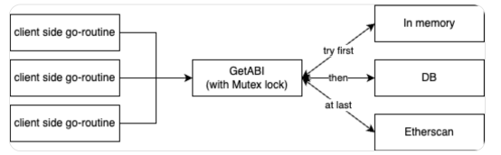
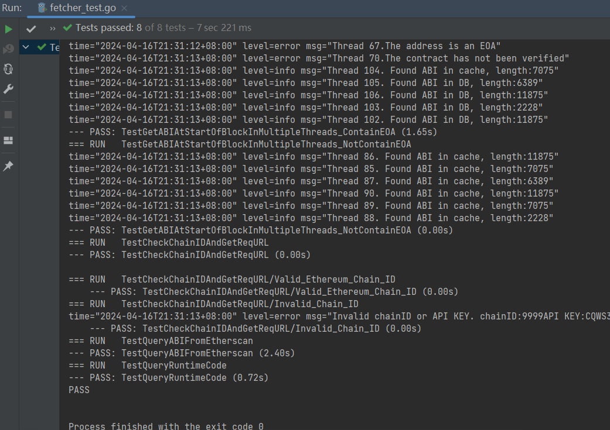

# EVM-ABI-Fetcher

## The design choices

I will bind `GetABIatStartOfBlock()` to a structure named `FetcherCli`, so that the core interface is: 

```go
type FetcherCli struct {
	ApiKey string // Etherscan
	RpcUrl string // Blockchain node RPC
	mu     sync.RWMutex
}

func (f *FetcherCli) GetABIAtStartOfBlock(db *gorm.DB, chainID int, contractAddress common.Address) ([]byte, error) {
```

The program will retrieve ABI from blockchain browsers corresponding to different chains and store it in the database. Now support Ethereum, BSC, Arbitrum, Polygon. 

We use a cache to increase access speed. Follow the sequence and strategy shown in the figure when querying ABI concurrently:



Note that if multiple threads query ABI for the same contract at the same time, ABI may be repeatedly inserted into the cache. Our solution is check twice: use mutexes and check again after obtaining the lock to prevent duplicate insert in the cache.
But we do not do this protection for the database. Reasons: the code redundancy, which may lead to a decrease in speed; The probability of duplicate insertion into the database is low; Even if there are multiple identical pieces of data in the database, it will not affect the normal operation of the program, only increasing the burden on the database slightly.

At the beginning of the program, due to the lack of data in the database and cache, the query speed will be slow (RPC calls consume a lot of time). When the program runs for a period of time and stores data in the database and cache, the speed of ABI queries will be very fast. 

Since the second test, the data has been cached in the database. Therefore, when we called `TestGetABIatStartOfBlockInMultipleThreads_NotContainEOA() ` for testing, the query time was only 0.03 seconds (30 milliseconds, less than the expected 100 milliseconds).

The test of the program should have similar output:



For ease of use and debugging, we have returned errors in the program and printed out logs.

## assumptions

- Before use, it is necessary to supplement the `.env` file.
- If the queried addresses are all open source contracts, the query speed will be very fast when the program runs stably
- If the queried address is EOA or has not been verified, an error is returned.
- EOA and unverified contracts will not be stored in the database. Therefore, if these addresses are queried again, they will still be queried through Etherscan's API, which will consume a lot of time.
- The generated data will be stored in a file named `ABIs.db`.
- Implementing least recently used (LRU) using bidirectional linked lists and maps.
- To prevent duplicate insertion of data into the cache, we perform a secondary check on the cache when obtaining RWMutex(before inserting the data).

## any dependencies

- Log: github.com/sirupsen/logrus
- Error: github.com/pkg/errors
- Fetch: github.com/ethereum/go-ethereum/common, github.com/ethereum/go-ethereum/ethclient
- Other stuff 


