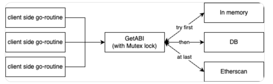

# ABI Caching Project

> The `README.md` will be updated when the project is completed



## Objective

The goal of this project is to cache smart contract ABIs in a database and provide a function to retrieve the ABI given a chain ID, contract address, and block number. The function should perform lazy fetching and caching to optimize performance.

## Database Schema

Create a database table using GORM and SQLite3 with the following schema:

- [x] Table 1:
  - [x] contract bytecode unique identifier(uuid or int) [primary key]
  - [x] contract bytecode(hex or bytea)
  - [x] contract source code ← (work on this only if you finished all other tasks)
  - [x] parameters at compile time (e.g., how many rounds of optimisation) ← (work on this only if you finished all other tasks)
  - [x] the whole ABI json of the contract
- [x] Table 2:
  - [x] function signature unique identifier(uuid or int)
  - [x] contract bytecode unique identifier (uuid or int) [foreign key]
  - [x] function signature(hex or bytea, 4bytes)
  - [x] function ABI(json string)
- [x] Table 3:
  - [x] chainID(int)
  - [x] contract address(bytea or hex)
  - [x] contract bytecode unique identifier(uuid or int)

## Get ABI Function (In GoLand)

- [ ] Implement a function with the following signature:
  - [ ] task 1
  - [ ] task 2
  - [ ] task 3


```go
[task 1]
// chainID + contractAddress + sig => functionABI
// require fast speed: user can search in cache and DB but not Etherscan. 
// we should set up a thread to search the ABI in Etherscan at regular time
func GetFunctionABIAtBlock(chainID int, addr common.Address, sig [4]byte, block *big.Int) (*abi.Method, error)

[task 2]
// chainID + contractAddress => contractABI
func GetContractABIAtBlock(chainID int, addr common.Address, block *big.Int) ([]*abi.Method, error)

[task 3]
// struct ABI{chainID, contractAddress, FunctionABI}
// sig => []ABI.     
// Note: it can be called {sig collision}
func GetFunctionABIAtBlock(sig [4], block *big.Int) ([]*abi.Method, error)
```

The function should perform the following steps:

- [ ] Check if the ABI exists in the database for the given chainID, contract address, and function signature.

  > If found, return the ABI from the database

- [ ] If the ABi is not found in the database, query Etherscan to retrieve the ABI

  > If Etherscan returns the ABI, store it in the database and return it

- [ ] If Etherscan does not have the ABI, return an appropriate error

## Caching

- [ ] Implement an in-memory cache using a map to store the most recently queried ABIs.
- [ ] Use a cache size of 1000 entries
- [ ] Implement a least recently used(LRU) eviction policy to remove the least recently accessed entries when the cache reaches its maximum size.
- [ ] Ensure thread-safety for concurrent access to the cache using a sync.RWMutex

## Error Handing and Logging

- [ ] If there is a timeout on Etherscan, wait and retry
- [ ] Handle errors gracefully and return appropriate error messages from the GetABI function
- [ ] Log errors and key events using the logrus logging package with the following log levels:
  - [ ] Error: For critical errors that prevent the function from executing properly
  - [ ] Warning: For non-critical issues or unexpected behavior
  - [ ] Info: For important events or milestones during the execution
  - [ ] Log the input parameters, retrieved ABI, and any error messages for debugging purposes

## Performance

- [ ] Optimize database queries by creating appropriate indexes on the ChainID, ContractAddress, and FuncSignature columns using GORM: Re indexes, we are okay with slow inserts, but we want very fast query speed. Do you create indexes for your tables?
- [ ] Implement caching to minimize the number of database queries and external API calls
- [ ] Aim for a maximum response time of 100ms for the GetABI function

## Testing and Validation

- [ ] Unit Tests:
  - [ ] Write unit test using the `testing` package in Go to cover the core functionality of the GetABI function
  - [ ] Test scenarios where the ABI is found in the database and retrieved from Etherscan. (Lets imagine later, we encountered a transaction, which calls into a contract without ABI. We know the data is “0xAAAA…..“. Now what we can do is, I would look up in table 2, and find all abis matches to 0xAAAA, and try each to see if it can decode the data.)
  - [ ] Test error handling for scenarios where the ABI is not found or Etherscan returns an error
- [ ] Integration Tests:
  - [ ] Write integration test to verify the interaction between the GetABI function, the database, and Etherscan
  - [ ] Test the caching mechanism to ensure that frequently accessed ABIs are retrieved from the cache
  - [ ] ~~Ensure that the proxy contract table is properly populated during the tests~~
- [ ] Validation:
  - [ ] Compare the retrieved ABIs with the expected ABIs from reliable sources to ensure correctness
  - [ ] Handle any discrepancies or inconsistencies between the retrieved ABIs and the expected ABIs

## Deliverables

- [ ] Pull Request on Github
- [ ] Go source code for the GetABI function and associated helper functions
- [ ] Unit and interation test suite using the `testing` package
- [ ] Documentation(README.md) explaining the design choices, assumptions, and any dependencies

## Timeline

- [ ] Day 1: Set up the development environment, create the database schema using GORM, and implement the basic GetABI function
- [ ] Day 2: integrate Etherscan for ABI retrieval and implement caching using a map and sync.RWMutex
- [ ] Day 3-4: Conduct through testing validation, and performance optimization
- [ ] Day 5: Prepare documentation, conduct final code review, and address any remaining issues
